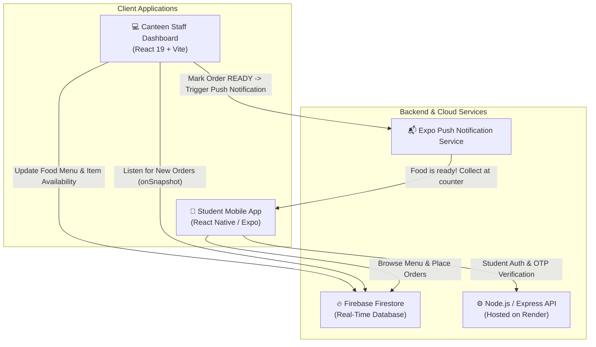

# 🍔 NMIMS Food Canteen App — Full-Stack Real-Time Ordering System

[](https://reactnative.dev/)
[](https://expo.dev/)
[](https://react.dev/)
[](https://firebase.google.com/)
[](https://expressjs.com/)
[](https://nmims-food-canteen-app-2.onrender.com)
[](https://opensource.org/licenses/MIT)

> A modern, end-to-end food ordering and canteen management system built for campus dining. Features a cross-platform **React Native mobile app** for students, a real-time **React web admin portal** for canteen kitchen staff, and an **Express.js backend** with real-time Firebase Firestore synchronization.

---

## 🔗 Quick Links for Recruiters & Reviewers

| Resource | Link | Description |
| :--- | :--- | :--- |
| 🌐 **Live Admin Web Portal** | *[Deploying to Vercel — see below]* | Live dashboard for canteen staff to view & process orders |
| 📱 **Download Android APK** | [Releases / Download APK](https://github.com/deepeshanjana45-create/Nmims-Food-Canteen-App/releases) | Install directly on any Android smartphone |
| ⚡ **Live Backend API** | [Render API](https://nmims-food-canteen-app-2.onrender.com) | Express & Node.js authentication and OTP microservice |
| 💻 **GitHub Repository** | [Nmims-Food-Canteen-App](https://github.com/deepeshanjana45-create/Nmims-Food-Canteen-App) | Full source code with monorepo setup |

---

## 📐 System Architecture



---

## ✨ Key Features

### 📱 1. Student Mobile App (`React Native` + `Expo`)
- **Campus Auth**: Student authentication with OTP verification sent via campus email.
- **Dynamic Menu & Search**: Browse categories (*Burgers, South Indian, Beverages, Combos, Desserts*), real-time search, and price filters.
- **Stock Awareness**: Instant reflection of item availability toggled by kitchen staff.
- **Cart & Order Customization**: Quantity selectors, item order notes, and real-time bill breakdown.
- **Order Lifecycle Tracking**: Live visual status progress: `RECEIVED` ➔ `PREPARING` ➔ `READY` ➔ `COMPLETED`.
- **Push Notifications**: Instant device alerts when kitchen staff marks an order as ready for pickup.
- **Order History & Profile**: Re-order past meals and view timestamps and transaction receipts.

### 💻 2. Canteen Admin Web Portal (`React` + `Vite` + `Firestore`)
- **Real-Time Order Kanban**: Live Firestore listeners automatically receive incoming orders with audio/toast alerts without page refresh.
- **Payment Verification**: Manual or automatic verification of UPI/Campus ID transactions with 1-click approval/rejection.
- **Kitchen Status Controls**: Update preparation status (`PREPARING`, `READY`, `COMPLETED`, `CANCELLED`).
- **Interactive Menu Management**: Add, edit, or delete food items with custom images, categories, and prep times.
- **Live Inventory Toggling**: Instantly toggle items out-of-stock to prevent surge over-ordering.
- **Sample Menu Seeder**: 1-click seeding of 15 authentic dishes into Firestore for quick demo resets.

---

## 🛠 Tech Stack

| Domain | Technology | Usage |
| :--- | :--- | :--- |
| **Mobile App** | React Native, Expo SDK 57, React Navigation v7 | Cross-platform Android & iOS client |
| **Web Admin** | React 19, Vite, Lucide Icons, Vanilla CSS | High-performance responsive staff dashboard |
| **Database** | Firebase Firestore | Real-time bidirectional data synchronization |
| **Backend** | Node.js, Express.js, Nodemailer, CORS | Auth microservice, OTP generation, and email verification |
| **Hosting** | Render (Backend API), Vercel (Admin Web Dashboard) | Production deployment |
| **Build & CI/CD** | EAS (Expo Application Services) | Android standalone `.apk` / `.aab` builds |

---

## 🚀 Getting Started Locally

### Prerequisites
- [Node.js](https://nodejs.org/) (v18 or higher)
- [Expo Go App](https://expo.dev/go) on your mobile device (or Android Studio emulator)
- [Git](https://git-scm.com/)

### 1. Clone the Repository
```bash
git clone https://github.com/deepeshanjana45-create/Nmims-Food-Canteen-App.git
cd Nmims-Food-Canteen-App
```

### 2. Run the Student Mobile App
```bash
npm install
npm run start
```
*Scan the generated QR code using **Expo Go** on Android or Camera on iOS.*

### 3. Run the Admin Web Portal
```bash
cd college-canteen
npm install
npm run dev
```
*Open `http://localhost:5173` to access the Canteen Staff Admin Portal.*

### 4. Run the Backend API (Optional - Live on Render)
```bash
node server.js
```

---

## 📱 How to Build the Standalone APK with EAS

The project is pre-configured with `eas.json` for APK generation:

1. **Install EAS CLI & Log In**:
   ```bash
   npm install -g eas-cli
   eas login
   ```

2. **Trigger Android Preview Build**:
   ```bash
   eas build --platform android --profile preview
   ```

3. **Download the APK**:
   Once the cloud build finishes, EAS provides a direct download link and QR code. You can download the `.apk` and attach it to your [GitHub Releases](https://github.com/deepeshanjana45-create/Nmims-Food-Canteen-App/releases).

---

## 🌐 Deploying the Admin Portal to Vercel (1-Click)

1. Go to [vercel.com](https://vercel.com) and click **"Add New Project"**.
2. Select repository: `deepeshanjana45-create/Nmims-Food-Canteen-App`.
3. Set **Root Directory** to `college-canteen`.
4. Framework Preset: **Vite**.
5. Click **Deploy**. Your dashboard will be live within 60 seconds with SSL!

---

## 📄 Resume Bullet Points (Copy & Paste Ready)

```text
NMIMS Campus Canteen Management & Real-Time Food Booking System
Tech Stack: React Native, React 19, Firebase Firestore, Node.js, Express, Expo, EAS
Links: [Live Admin Portal] | [GitHub Repo] | [Download Android APK]

• Engineered an end-to-end campus dining solution featuring an Expo/React Native mobile app for 1,000+ students and a React admin web portal for kitchen operations.
• Implemented live bidirectional synchronization using Firebase Firestore listeners, cutting peak cafeteria wait times with real-time order tracking and push notifications.
• Developed a secure Node.js/Express backend handling OTP campus authentication, payment status verification, and automated menu inventory controls.
```

---

## 👨‍💻 Author

- **Deepesh Anjana** — [GitHub Profile](https://github.com/deepeshanjana45-create)
- Project Repository: [Nmims-Food-Canteen-App](https://github.com/deepeshanjana45-create/Nmims-Food-Canteen-App)
